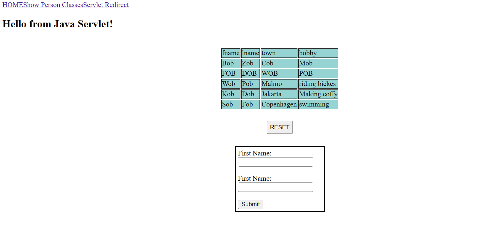
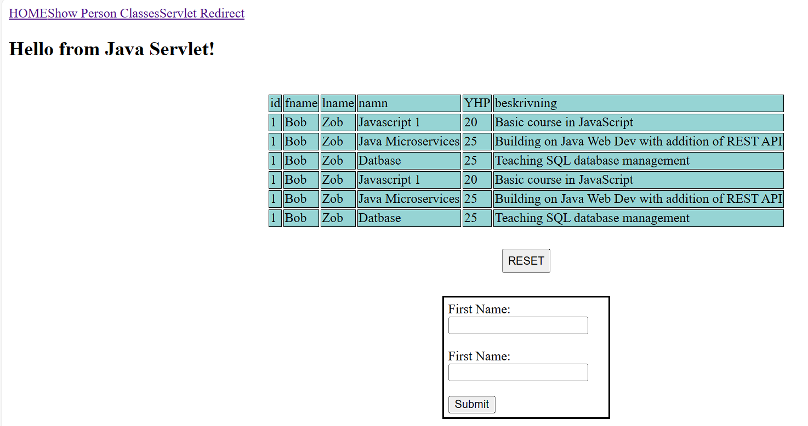
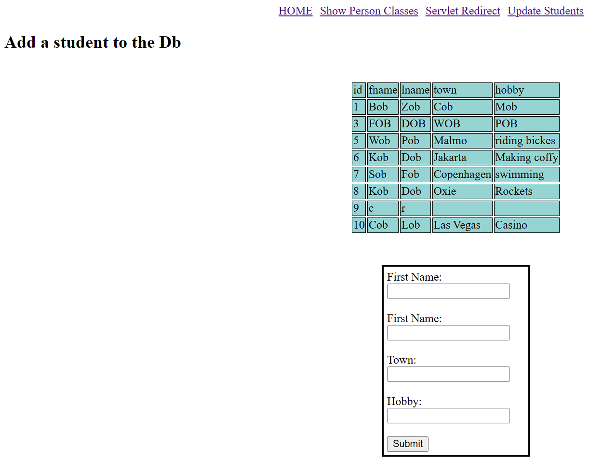

# Java23_WebDev_Lecture2

## this Project shows how to redirect the Client from one Servlet to another and how to use custom SELECT and INSERT queries with HTML forms.
### The queries used in this project are imported from the csv file by the MySQLConnector. new
### queries can be added there. As of now the MySQL connector support SELECT and INSERT queries only.

## In this project Servlet PersonChooser shows a table with all of the students and a form.
### Client can put in a student name in the form and if the student exist in the Db all of the courses the student attends will be shown.

### Working code should look like this one "/personchooser" web-page
#### Before student data send to server

#### After course data recieved from server

## Servlet /updatestudents is responsible for adding a student to the DB via form

